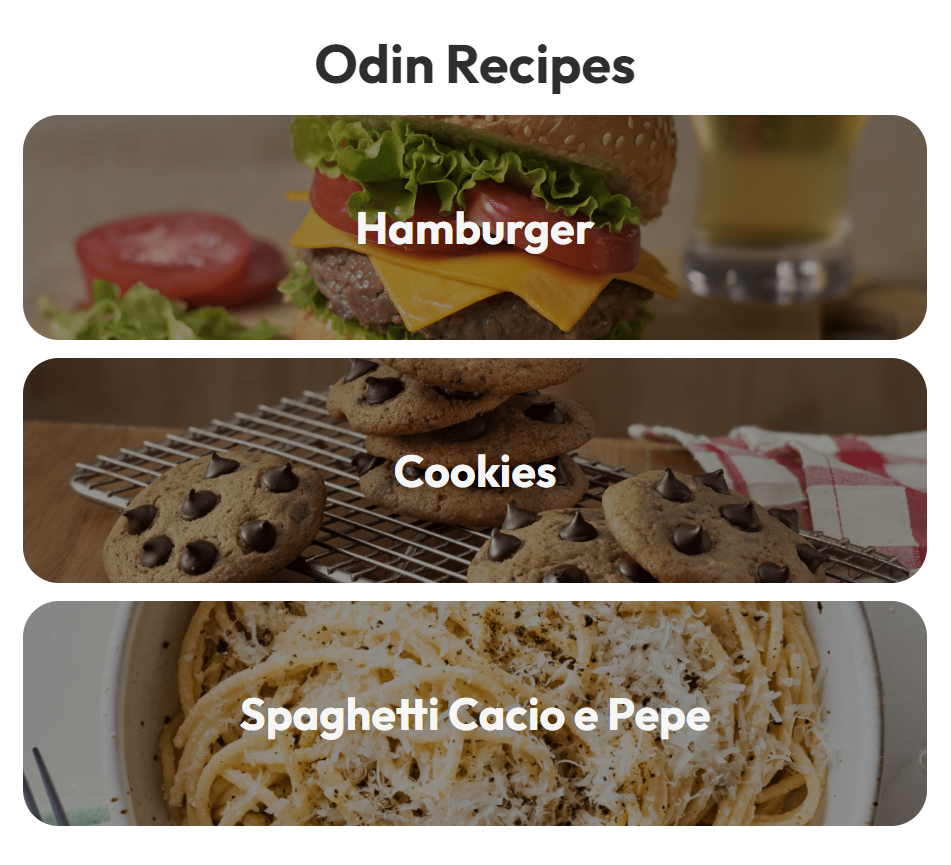

# Site de receitas

O primeiro projeto proposto pelo site [The Odin Project](https://www.theodinproject.com), para fixação do aprendizado de HTML. Trata-se de um site simples com receitas. Neste ponto ainda não haviam ensinado CSS, então não foi pedido, mas revisitando o projeto depois de alguns meses, fiz um CSS (com Sass) bem simples, mas elegante!
O projeto pode ser acessado no link [diego-moreira8.github.io/odin-recipes](https://diego-moreira8.github.io/odin-recipes/).

## Como usar

Basta clonar ou baixar e extrair o projeto e abrir o arquivo `index.html`.
